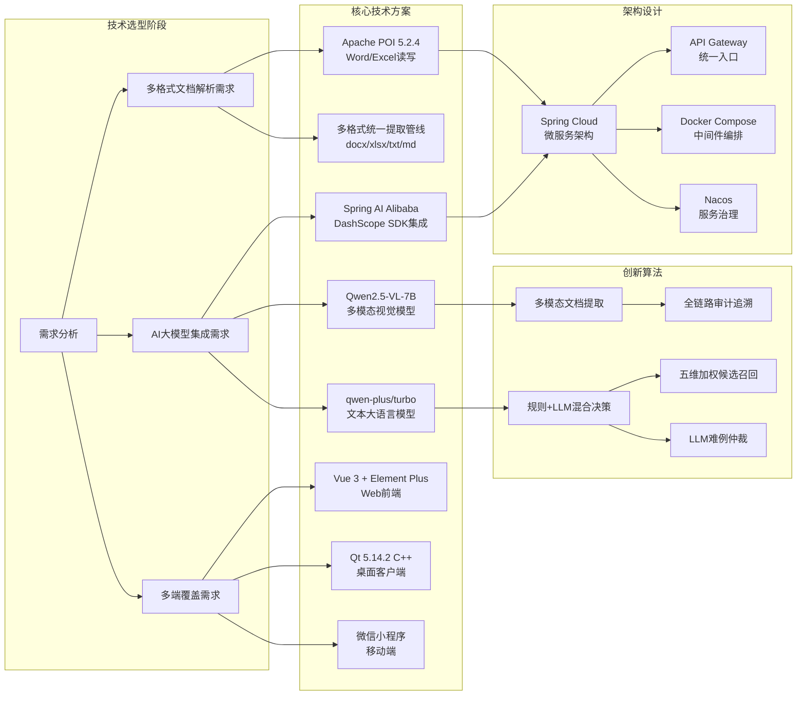
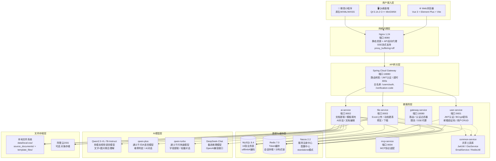
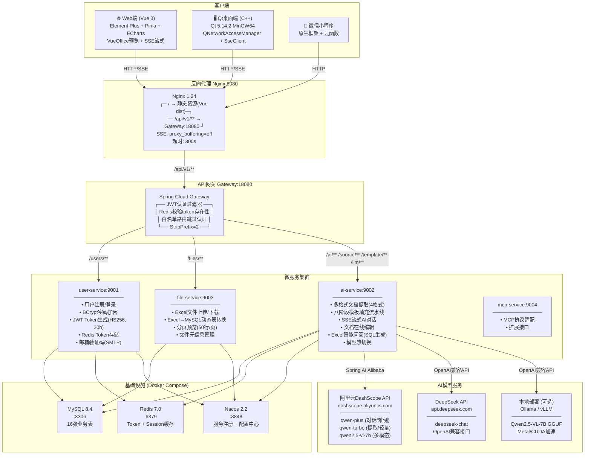
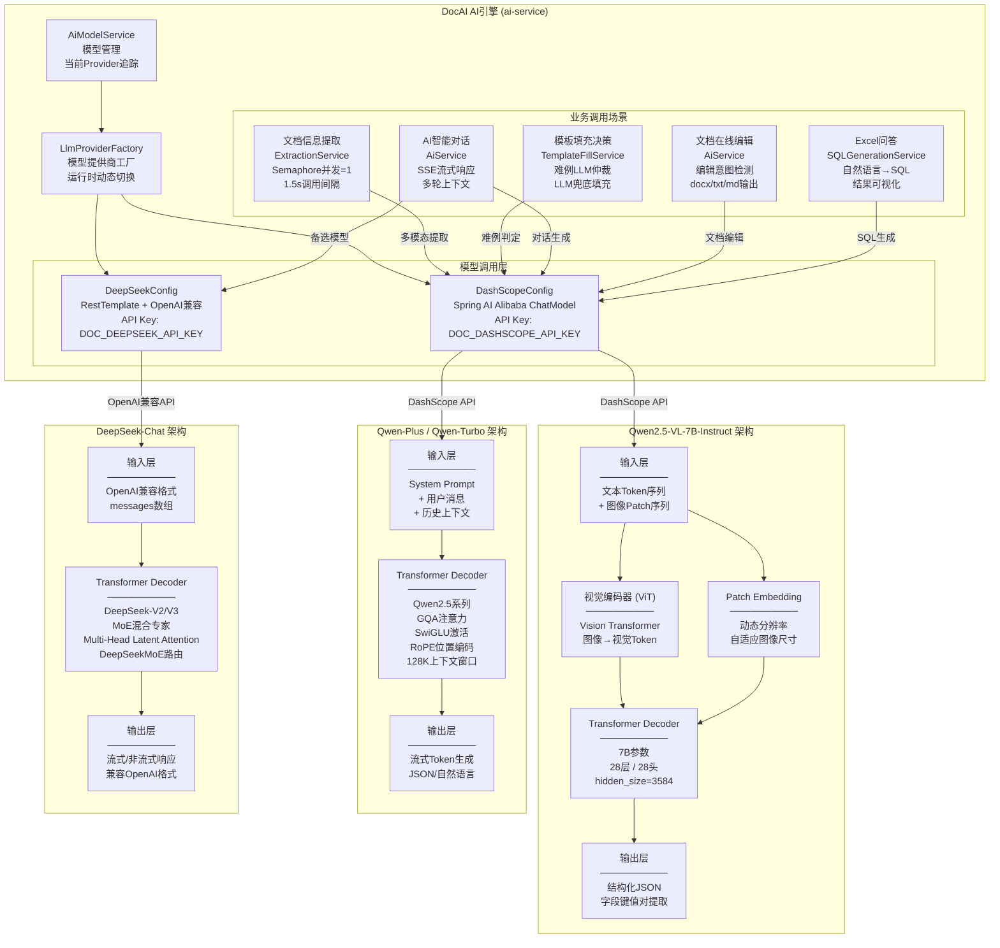
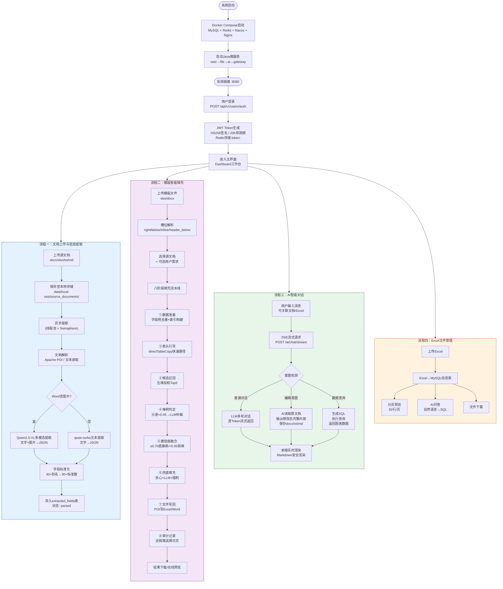
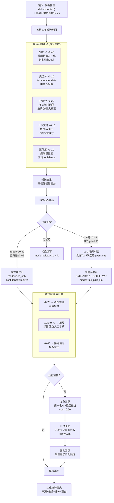
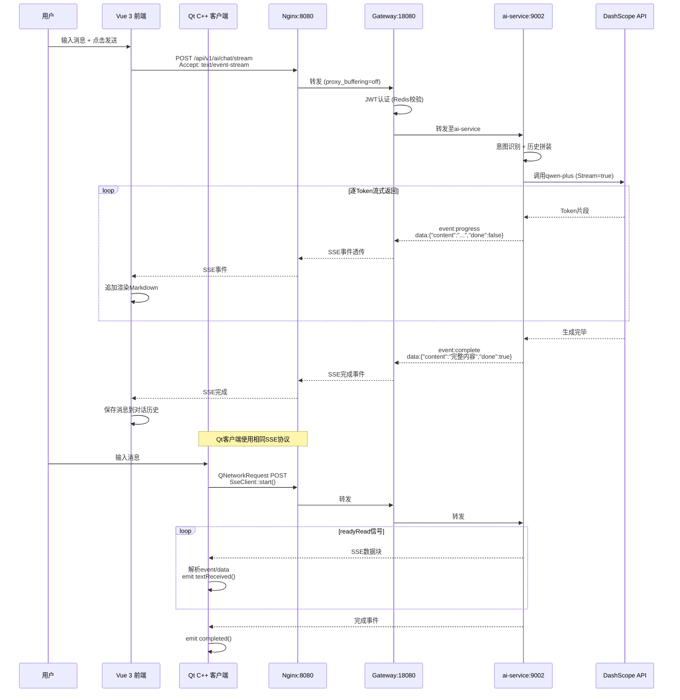
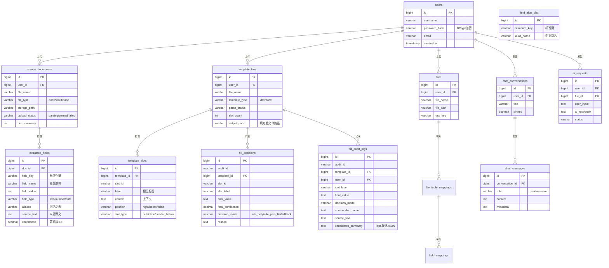

# DocAI 智能文档处理系统 — 作品介绍

---

## 一、作品简介

DocAI是基于大语言模型的智能文档信息提取与自动填表系统，支持Word/Excel/TXT/Markdown多格式文档解析，通过AI自动提取关键信息并智能填充至模板表格，将数小时人工整理缩短至90秒内完成，准确率≥90%，具备全链路审计追溯能力。

---

## 二、开源代码与组件使用情况说明

### 2.1 开源框架与组件

| 组件名称 | 版本 | 开源协议 | 用途说明 |
|---------|------|---------|---------|
| **Vue.js 3** | 3.5.25 | MIT | 前端单页应用框架 |
| **Element Plus** | 2.13.3 | MIT | 前端UI组件库 |
| **Pinia** | 3.0.4 | MIT | 前端状态管理 |
| **Vite** | - | MIT | 前端构建工具 |
| **Axios** | 1.13.6 | MIT | HTTP客户端 |
| **ECharts** | 6.0.0 | Apache-2.0 | 数据可视化图表 |
| **Marked** | 17.0.4 | MIT | Markdown渲染引擎 |
| **DOMPurify** | 3.3.3 | Apache-2.0/MPL-2.0 | XSS安全过滤 |
| **VueOffice (Docx/Excel)** | 1.6.3/1.7.14 | MIT | 文档在线预览 |
| **Mammoth** | 1.12.0 | BSD-2 | Word文档解析 |
| **SheetJS (XLSX)** | 0.18.5 | Apache-2.0 | Excel客户端处理 |
| **wangEditor** | 5.1.23 | MIT | 富文本编辑器 |
| **Spring Boot** | 3.2 | Apache-2.0 | 后端微服务框架 |
| **Spring Cloud Gateway** | 2023.0.0 | Apache-2.0 | API网关路由与限流 |
| **Spring AI Alibaba** | 1.0.0.2 | Apache-2.0 | 大模型集成框架（DashScope） |
| **MyBatis-Plus** | 3.5.7 | Apache-2.0 | ORM持久化框架 |
| **Apache POI** | 5.2.4 | Apache-2.0 | Excel/Word模板读写 |
| **FastJSON 2** | 2.0.43 | Apache-2.0 | JSON解析 |
| **JJWT** | 0.11.5 | Apache-2.0 | JWT认证令牌生成与校验 |
| **阿里云OSS SDK** | 3.17.4 | MIT | 对象存储（可选） |
| **HttpClient 5** | 5.2.1 | Apache-2.0 | HTTP客户端 |
| **pinyin4j** | 2.5.1 | GPL-2.0 (with CE) | 中文拼音处理 |
| **Nacos** | 2.2 | Apache-2.0 | 服务注册与配置中心 |
| **MySQL** | 8.4 | GPL-2.0 | 关系型数据库 |
| **Redis** | 7.0 | BSD-3 | 分布式缓存 |
| **Nginx** | 1.24 | BSD-2 | 反向代理与静态资源服务 |
| **Qt** | 5.14.2 | LGPL-3.0 | 跨平台C++桌面GUI框架 |
| **Docker Compose** | v2+ | Apache-2.0 | 容器化中间件编排 |

### 2.2 AI模型

| 模型 | 提供商 | 用途 |
|------|--------|------|
| Qwen2.5-VL-7B-Instruct | 阿里云/开源 | 多模态文档信息提取（文字+图片） |
| qwen-plus / qwen-turbo | 阿里云DashScope | 难例LLM判定与AI对话 |
| DeepSeek（可选） | DeepSeek | 备选推理模型 |

### 2.3 自主开发部分

本项目自主实现了以下核心模块，**非直接引用已有开源项目**：
- 多格式文档统一提取管线（docx/xlsx/txt/md四格式解析+LLM抽取）
- 八阶段模板智能填充流水线（槽位解析→候选召回→难例判定→置信度融合→模板写回）
- 五维加权候选召回评分算法（别名×0.40 + 类型×0.20 + 投票×0.20 + 上下文×0.10 + 置信度×0.10）
- 全链路审计日志追溯系统
- SSE流式AI对话与文档在线编辑功能
- Qt C++桌面客户端完整实现
- 微信小程序适配层

---

## 三、作品安装说明

### 3.1 环境要求

| 软件 | 最低版本 | 用途 |
|------|---------|------|
| JDK | 17+ | 后端运行 |
| Maven | 3.8+ | Java项目构建 |
| Node.js | 18+ | 前端构建 |
| Docker & Docker Compose | 24+ / v2+ | 中间件容器化 |

**硬件建议**：4核CPU / 8GB内存 / 20GB磁盘（开发环境最低配置）

### 3.2 必需环境变量

```
DOC_DASHSCOPE_API_KEY=sk-xxxxxxxx  （阿里云DashScope API密钥，从 dashscope.console.aliyun.com 获取）
```

### 3.3 后端一键启动（Windows）

```powershell
cd docai-pro-后端
$env:DOC_DASHSCOPE_API_KEY = "sk-xxxxxxxx"
.\start-lite-windows.ps1
```

脚本自动完成：环境检测 → Maven构建 → 前端npm构建 → Docker启动MySQL/Redis/Nacos/Nginx → 微服务启动（user-service:9001 → file-service:9003 → ai-service:9002 → gateway:18080）

### 3.4 前端单独启动（开发模式）

```bash
cd docai-frontend-前端
npm install
npm run dev
```

### 3.5 Qt桌面客户端

使用Qt Creator 5.14.2打开`DocAI-Qt客户端/DocAI.pro`，配置MinGW 64-bit编译器后构建运行。

### 3.6 微信小程序

使用微信开发者工具导入`wechat-mini-program-小程序`目录，配置AppID后编译预览。

### 3.7 启动验证

| 验证项 | 访问地址 | 预期结果 |
|--------|---------|---------|
| Web前端 | http://localhost:8080 | 显示登录页 |
| API网关 | http://localhost:18080 | 网关响应 |
| Nacos控制台 | http://localhost:8848/nacos | nacos/nacos登录 |

---

## 四、设计思路

### 4.1 整体架构

系统采用**前后端分离 + 微服务架构**设计，分为四个独立端：

```
用户端（Web/Qt/小程序） → Nginx反向代理(8080) → Spring Cloud Gateway(18080)
  → 微服务层：user-service(9001) + file-service(9003) + ai-service(9002)
  → 基础设施层：MySQL 8.4 + Redis 7.0 + Nacos 2.2（Docker Compose编排）
```

### 4.2 核心设计理念

1. **双阶段分离架构**：将文档信息提取与模板填充解耦为两个独立阶段——源文档上传时异步预提取结构化字段，模板填充时从已有字段库中快速检索匹配，避免实时调用LLM造成的高延迟。

2. **规则优先、模型辅助**：90%以上字段由五维加权规则引擎快速决策，仅对Top1/Top2分差<0.05的难例才调用LLM仲裁，兼顾速度与准确率，同时大幅降低API调用成本。

3. **多格式统一框架**：docx/xlsx/txt/md四种格式统一进入同一提取管线，新增格式只需实现解析适配器即可扩展，无需改动下游填充逻辑。

4. **全链路可审计**：每个填入字段都生成包含来源文档、原文、候选评分、决策方式、决策理由的完整审计日志，支持结果验证与持续优化。

5. **多端覆盖**：Web端满足日常办公，Qt桌面端提供原生体验，微信小程序实现移动端触达，三端共享同一套后端API。

### 4.3 填充流水线设计

八阶段处理流程：基础设施定义 → 源文档异步提取 → 字段标准化归一 → 模板槽位解析 → 五维候选召回(Top5) → LLM难例判定 → 置信度阈值融合 → 模板写回+审计追溯

---

## 五、设计重点难点

### 5.1 多格式文档统一提取

**难点**：Word文档中包含段落、表格、嵌入图片等多种内容形式，Excel有多Sheet多列结构，不同格式的信息组织方式差异巨大。

**解决方案**：设计统一的Document→Text→LLM→Fields管线。Word通过Apache POI提取段落文本+表格文本+嵌入图片（最多2张），Excel逐Sheet逐行拼接，TXT/MD直接读取。统一截断至15000字符后送入Qwen2.5-VL多模态模型进行结构化抽取。图片通过VL模型实现视觉理解，提取图片中的表格和文字信息。

### 5.2 候选召回与决策精度

**难点**：同一字段在不同文档中可能有不同名称（如"项目名称"与"课题名称"），多文档可能包含重复或冲突数据。

**解决方案**：构建字段别名词典(field_alias_dict)支持40+中文别名到30+标准键的映射。五维加权评分综合别名匹配度、类型匹配度、多文档投票、上下文关联、提取置信度。多级去重机制（字段级、候选级、行级）确保数据不重复不冲突。

### 5.3 表格直写与统计聚合

**难点**：模板中的表头行模板需要从源Excel复制整列数据并自动去重，汇总型槽位需要从数据列中自动计算统计值。

**解决方案**：`directTableCopy`策略直接匹配源Excel与模板的表头结构，跳过逐槽LLM调用，将匹配列的数据行批量复制。识别"总"→SUM、"平均"→AVG等关键词自动执行统计聚合。实测38000+原始行去重为4500+有效行，处理时间约5秒。

### 5.4 SSE流式AI对话与文档在线编辑

**难点**：大模型生成响应耗时长，需实时展示生成过程；用户通过自然语言修改文档需识别编辑意图并保持原文档格式。

**解决方案**：采用SSE(Server-Sent Events)实现流式传输，前端逐token渲染打字效果。通过关键词检测（修改/编辑/删除/润色等12个动词）自动识别编辑意图，AI输出修改后的完整文档内容，后端自动保存为docx/txt/md格式。

---

## 六、创新描述

**创新点一：源文档预提取+模板实时匹配的双阶段解耦架构。** 将信息提取与模板填充分离为异步预提取和实时匹配两个独立阶段，模板填充时无需再次调用LLM，响应时间从分钟级降至秒级，为业界首创的文档填表加速方案。

**创新点二：规则优先、模型辅助的多级混合决策引擎。** 独创五维加权候选召回+LLM难例仲裁的分层决策架构，90%字段纯规则毫秒级决策，仅难例调用LLM，相比纯LLM方案API调用量降低80%+，兼顾速度、准确率与成本可控。

**创新点三：多模态视觉语言模型驱动的文档全要素提取。** 业界竞品仅支持纯文本OCR识别，DocAI集成Qwen2.5-VL多模态视觉模型，可同时理解文档中的文字、表格和嵌入图片，实现图文混排文档的全要素结构化提取，填补了智能填表领域的多模态识别空白。

---

## 七、AI在作品中的应用说明

### 7.1 AI技术应用概览

DocAI系统深度融合了大语言模型（LLM）和多模态视觉语言模型（VL Model），AI贯穿系统的文档处理、智能决策、用户交互三大核心环节。

### 7.2 具体应用场景

#### （1）多模态文档信息提取

- **使用模型**：Qwen2.5-VL-7B-Instruct（多模态视觉语言模型）
- **应用方式**：用户上传Word/Excel/TXT/Markdown文档后，系统自动异步调用VL模型，将文档文本（截断至15000字符）及Word中嵌入的图片（最多2张）一并送入模型进行结构化信息抽取
- **AI输出**：模型以JSON格式返回提取的字段键值对，包含字段名、字段值、字段类型、来源原文、置信度评分等
- **失败兜底**：若AI模型调用失败，系统自动降级为基于正则表达式的规则提取（模式：`key:value`行匹配），确保可用性

#### （2）智能填表难例判定

- **使用模型**：qwen-plus（通义千问大语言模型）
- **触发条件**：仅在规则引擎无法确定最佳候选时触发——即Top1与Top2候选分差<0.05且值不同，或Top1得分<0.30且别名匹配度<0.2
- **应用方式**：将槽位标签、上下文、Top5候选字段及评分组成Prompt发送给LLM，LLM从候选中选择最佳值并给出置信度
- **融合策略**：最终置信度 = 0.70 × 规则候选分 + 0.30 × LLM置信度，决策模式标记为`rule_plus_llm`

#### （3）LLM兜底填充

- **使用模型**：qwen-plus
- **触发条件**：经过规则决策和难例判定后仍有空槽位时
- **应用方式**：汇聚所有已提取字段的来源原文（<8000字符则补充完整源文档），构造提取提示词，请求LLM重新从原始文本中提取目标字段
- **决策标记**：`llm_fallback`，置信度设为0.65

#### （4）AI智能对话与文档编辑

- **使用模型**：qwen-plus / qwen-turbo / DeepSeek（用户可热切换）
- **交互方式**：基于SSE（Server-Sent Events）实现流式实时对话，支持多轮上下文
- **功能集**：
  - 文档内容摘要、信息提取、润色优化、格式调整
  - 数据分析（关联Excel文件自动生成SQL查询）
  - **AI文档在线编辑**：通过自然语言指令（如"删除第三段"、"将标题改为XXX"），AI自动读取原文档，输出修改后的完整内容并保存为可下载文件
  - 编辑意图识别：基于12个关键动词（修改/编辑/删除/增加/添加/替换/改为/改成/更新/移除/插入/润色）自动检测

#### （5）Excel智能问答

- **使用模型**：qwen-plus
- **应用方式**：用户上传Excel后可通过自然语言提问，系统将Excel转为MySQL动态表，AI根据用户问题自动生成SQL查询语句，执行后返回结构化结果和可视化图表

### 7.3 AI调用优化策略

| 策略 | 说明 | 效果 |
|------|------|------|
| 规则优先 | 90%+字段由五维加权规则引擎决策 | LLM调用量降低80%+ |
| 信号量并发控制 | Semaphore限制同时LLM请求数 | 避免API限流 |
| 1.5秒调用间隔 | 相邻LLM请求间强制等待 | 平滑API负载 |
| 指数退避重试 | 失败后最多3次重试 | 提升稳定性 |
| 30秒超时保护 | 超时后跳过LLM，使用规则Top1 | 保障响应速度 |
| 模型热切换 | 运行时切换qwen-plus/DeepSeek | 灵活适配 |

---

## 八、开发制作工具

### 8.1 开发工具

| 工具名称 | 版本/说明 | 用途 |
|---------|----------|------|
| **IntelliJ IDEA** | Ultimate | Java后端微服务开发（Spring Boot） |
| **Visual Studio Code** | Latest | 前端Vue 3开发 & 脚本编写 |
| **Qt Creator** | 5.14.2 | Qt C++桌面客户端开发 |
| **微信开发者工具** | Latest | 微信小程序开发与调试 |
| **Navicat / DataGrip** | - | MySQL数据库管理与SQL调试 |
| **Postman** | - | API接口调试与测试 |
| **Docker Desktop** | 24+ | 中间件容器化运行环境 |
| **Git** | 2.30+ | 版本控制 |

### 8.2 构建与部署工具

| 工具名称 | 版本 | 用途 |
|---------|------|------|
| **Apache Maven** | 3.8+ | Java项目构建与依赖管理 |
| **npm** | 9+ | 前端Node.js包管理 |
| **Vite** | Latest | 前端开发热重载与生产构建 |
| **qmake (MinGW 64-bit)** | Qt 5.14.2 | Qt项目编译构建 |
| **Inno Setup** | 6.x | Windows桌面端安装包打包 |
| **Docker Compose** | v2+ | 中间件统一编排（MySQL/Redis/Nacos/Nginx） |
| **Nginx** | 1.24 | 前端静态资源部署与API反向代理 |

### 8.3 运行环境

| 环境 | 版本 | 说明 |
|------|------|------|
| **JDK** | 17+ | Java后端运行时 |
| **Node.js** | 18+ | 前端构建运行时 |
| **MySQL** | 8.4 | 业务数据存储 |
| **Redis** | 7.0 | 分布式缓存（Token/会话/锁） |
| **Nacos** | 2.2 | 微服务注册中心与配置中心 |

### 8.4 AI平台与工具

| 平台/工具 | 说明 |
|----------|------|
| **阿里云DashScope** | 通义千问系列模型API（qwen-plus/qwen-turbo） |
| **Spring AI Alibaba** | Spring生态AI集成框架，对接DashScope |
| **Qwen2.5-VL-7B** | 开源多模态视觉语言模型（可本地部署或API调用） |
| **Ollama / vLLM** | 本地模型推理引擎（可选，用于私有化部署） |

### 8.5 设计与文档工具

| 工具 | 用途 |
|------|------|
| **Markdown** | 项目文档撰写 |
| **Draw.io / Mermaid** | 架构图与流程图绘制 |
| **GitHub Copilot** | AI辅助编程 |

---

## 九、技术路线图

### 9.1 总体技术路线



### 9.2 技术栈分层架构



---

## 十、系统架构图

### 10.1 系统整体架构图



### 10.2 AI模型架构与调用关系



### 10.3 程序运行总流程图



### 10.4 候选召回与决策引擎详细流程



### 10.5 SSE流式通信架构



### 10.6 数据库ER关系图


